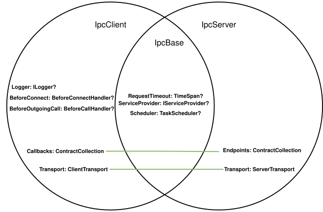

# UiPath.Ipc

[](https://uipath.visualstudio.com/CoreIpc/_build?definitionId=637)
[](https://uipath.visualstudio.com/Public.Feeds/_artifacts/feed/UiPath-Internal/NuGet/UiPath.Ipc/overview/2.5.1-20250714-01)
[](https://github.com/UiPath/coreipc/pkgs/npm/coreipc)
[](https://github.com/UiPath/coreipc/pkgs/npm/coreipc-web)
[](https://opensource.org/licenses/MIT)


> **Lightweight RPC framework** enabling bidirectional communication with interface-based contracts over **Named Pipes, TCP/IP, and WebSockets**. Supports .NET servers/clients and [Node.js/Web clients](src/Clients/js).

## 🚀 Features

- **🔄 Asynchronous**: Fully async/await compatible API
- **🔥 One-way Calls**: Fire-and-forget methods (methods returning non-generic `Task`)
- **📞 Callbacks**: Bidirectional communication with callback interfaces
- **⚡ Task Scheduling**: Configurable task scheduler support
- **📡 Multiple Transports**: Named Pipes, TCP/IP, WebSockets or custom transport
- **🔒 Security**: Client authentication and impersonation for Named Pipes
- **📦 JSON Serialization**: Built-in JSON serialization with Newtonsoft.Json
- **🏗️ DI Support**: Integration with Microsoft.Extensions.DependencyInjection
- **⏰ Cancellation & Timeouts**: Comprehensive cancellation token and timeout support
- **🔄 Auto-reconnect**: Broken connections are re-established transparently; you keep using the same proxy instance.
- **🛡️ Interception**: BeforeConnect, BeforeIncommingCall and BeforeOutgoingCall interception capabilities
- **📊 Stream Access**: Direct access to underlying transport streams
- **🌐 Cross-platform**: .NET 6, .NET Framework 4.6.1, and .NET 6 Windows support

## 📦 Installation

```bash
dotnet add package UiPath.Ipc
```

## 🏃‍♂️ Quick Start

### 1. Define Your Service Contract

```csharp
public interface IComputingService
{
    Task<float> AddFloats(float x, float y, Message m = null!, CancellationToken ct = default);
    Task<bool> Wait(TimeSpan duration, CancellationToken ct = default);
}

public interface IComputingCallback
{
    Task<string> GetThreadName();
}
```

### 2. Implement Your Service

```csharp
public sealed class ComputingService : IComputingService
{
    public async Task<float> AddFloats(float a, float b, Message m = null!, CancellationToken ct = default)
    {
        return a + b;
    }

    public async Task<bool> Wait(TimeSpan duration, CancellationToken ct = default)
    {
        await Task.Delay(duration, ct);
        return true;
    }
}
```

### 3. Create and Start the Server

> Creating a server is done by instantiating the `IpcServer` class, setting its properties and calling the `Start` method.

```csharp
await using var serviceProvider = new ServiceCollection()
    .AddScoped<IComputingService, ComputingService>()
    .BuildServiceProvider();

await using var server = new IpcServer
{
    Transport = new NamedPipeServerTransport { PipeName = "computing" },
    ServiceProvider = serviceProvider,
    Endpoints = new() { typeof(IComputingService) }
};
server.Start();
await server.WaitForStart();
```

### 3. Create the Client

> Creating a client is done by 1st implementing all the callback interfaces you'll want to expose as a client:

```csharp
public sealed class ComputingCallback : IComputingCallback
{
    public Task<string> GetThreadName() => Task.FromResult(Thread.CurrentThread.Name);
}
```

and then instantiating the `IpcClient`, setting its properties, obtaining a proxy via the `GetProxy<T>` method and using that proxy.

```csharp
await using var serviceProvider = new ServiceCollection()
    .AddScoped<IComputingCallback, ComputingCallback>()
    .BuildServiceProvider();

var client = new IpcClient
{
    Transport = new NamedPipeClientTransport { PipeName = "computing" },
    ServiceProvider = serviceProvider,
    Callbacks = new() { typeof(IComputingCallback) }
}

var computingService = client.GetProxy<IComputingService>();
var three = await computingService.AddFloats(1, 2);
```

## 🔧 Advanced Features

### Callbacks and Bidirectional Communication

```csharp
public class ComputingCallback : IComputingCallback
{
    public async Task<string> GetThreadName()
    {
        return Thread.CurrentThread.Name ?? "Unknown";
    }

    public async Task<int> AddInts(int x, int y)
    {
        return x + y;
    }
}

// Server can call back to client
public async Task<string> GetCallbackThreadName(TimeSpan waitOnServer, Message message, CancellationToken cancellationToken)
{
    await Task.Delay(waitOnServer, cancellationToken);
    return await message.Client.GetCallback<IComputingCallback>().GetThreadName();
}
```

### Dependency Injection Integration

```csharp
var services = new ServiceCollection()
    .AddLogging(builder => builder.AddConsole())
    .AddSingleton<IComputingService, ComputingService>()
    .AddSingleton<ISystemService, SystemService>()
    .BuildServiceProvider();

var ipcServer = new IpcServer
{
    ServiceProvider = services,
    // ... other configuration
};
```

### Custom Task Scheduling

```csharp
var ipcServer = new IpcServer
{
    Scheduler = new ConcurrentExclusiveSchedulerPair().ExclusiveScheduler,
    // ... other configuration
};
```

## 🧩 Notable Types

### 1. The `IpcServer`, `IpcClient` and `IpcBase` classes.

> This hierarchy is used for creating and hosting servers and clients respectively.

> ```csharp
> public abstract class IpcBase { ... }
> public sealed class IpcServer : IpcBase { ... }
> public sealed class IpcClient : IpcBase { ... }
> ```



#### i. `IpcBase`

> This class defines the settings shared between servers and clients.

| Property | Type | Notes |
| -------- | ---- | ----- |
| ServiceProvider | IServiceProvider? | **Optional**, defaults to **null**: Resolves services when handling incomming calls. |
| Scheduler | TaskScheduler? |  **Optional**, defaults to the thread pool: Schedules incomming calls. |
| RequestTimeout | TimeSpan? | **Optional**, defaults to infinity: Interval after which the honoring of requests will time out. |


#### ii. `IpcServer`

**Declared properties**

| Property | Type | Notes |
| -------- | ---- | ----- |
| Endpoints | ContractCollection  | **Required**: The collection of `ContractSettings`, which specifies the services to be exposed over Ipc. |
| Transport | ServerTransport |  **Required**: The server's transport, meaning whether it accepts connection over Named Pipes, TCP/IP, WebSockets, or a custom communication mechanism. |

**Methods**

| Method | Description |
| ------ | ----------- |
| `void Start()` | This method starts hosting the current `IpcServer` instance, meaning that it's imminent the transport will start listening and accepting connections, and those connections' calls will start to be honored. <br /> <br /> It's thread-safe, idempotent and fire&forget in nature, meaning it doesn't wait for the listener to become active. Further changes to the otherwise mutable `IpcServer` instance  have no effect on the listener's settings or its exposed service collection. <br /> <br /> Exceptions: <br />- `InvalidOperationException`: wrong configurations, such a `null` or invalid transport.<br />- `ObjectDisposedException`: the `IpcServer` instance had been disposed. |
| `Task WaitForStart()` | This method calls `Start` and then awaits for the connection accepter to start. It's thread-safe and idempotent. |
| `ValueTask DisposeAsync()` | Stops the connection accepter and cancels all active connections before completing the returned `ValueTask`. |

<hr />

#### iii. `IpcClient`

**Declared properties*

| Property | Type | Notes |
| -------- | ---- | ----- |
| Callbacks | ContractCollection  | **Optional**: The collection of `ContractSettings`, which specifies the services to be exposed over Ipc **as callbacks**. |
| Transport | ClientTransport |  **Required**: The client's transport, meaning whether it connects to the server over Named Pipes, TCP/IP, WebSockets, or a custom communication mechanism. |

**Methods**

| Method | Notes |
| ------ | ----- |
| `TProxy GetProxy<TProxy>() where TProxy : class` | Returns an Ipc proxy of the specified type, which is the gateway for remote calling. This method is idempotent, meaning that it will cache its result. |

### 2. The `ContractCollection` and `ContractSettings` classes.

#### i. `ContractCollection`

> `ContractCollection` is a type-safe collection that holds `ContractSettings` instances, mapping service interface types to their configuration. It implements `IEnumerable<ContractSettings>` and provides convenient `Add` methods for different scenarios.

**Add Methods:**

| Method | Description |
| ------ | ----------- |
| `Add(Type contractType)` | Adds a contract type that will be resolved from the service provider when needed (deferred resolution). |
| `Add(Type contractType, object? instance)` | Adds a contract type with a specific service instance. If `instance` is `null`, uses deferred resolution. |
| `Add(ContractSettings endpointSettings)` | Adds a pre-configured `ContractSettings` instance directly. |

#### ii. `ContractSettings`

> `ContractSettings` represents the configuration for a single service contract, including how the service instance is created/resolved, task scheduling, and call interception.

**Properties:**

| Property | Type | Description |
| -------- | ---- | ----------- |
| `Scheduler` | `TaskScheduler?` | **Optional**: Custom task scheduler for this specific contract. Inherits from `IpcBase.Scheduler` if not set. |
| `BeforeIncomingCall` | `BeforeCallHandler?` | **Optional**: Interceptor called before each incoming method call on this contract. |

**Constructors:**

| Constructor | Description |
| ----------- | ----------- |
| `ContractSettings(Type contractType, object? serviceInstance = null)` | Creates settings for a contract type with optional direct service instance. If `serviceInstance` is `null`, uses deferred resolution. |
| `ContractSettings(Type contractType, IServiceProvider serviceProvider)` | Creates settings for a contract type with explicit service provider for dependency injection. |

**Service Resolution Strategies:**

- **Direct Instance**: When you provide a service instance, that exact instance is used for all calls
- **Deferred Resolution**: When no instance is provided, the service is resolved from the `IpcServer`'s `ServiceProvider` when needed
- **Injected Resolution**: When you provide a specific `IServiceProvider`, services are resolved from that provider

**Usage Examples:**

```csharp
// Direct instance
var settings1 = new ContractSettings(typeof(IComputingService), new ComputingService());

// Deferred resolution (will use IpcServer.ServiceProvider)
var settings2 = new ContractSettings(typeof(IComputingService));

// Custom service provider
var customProvider = new ServiceCollection()
    .AddTransient<IComputingService, ComputingService>()
    .BuildServiceProvider();
var settings3 = new ContractSettings(typeof(IComputingService), customProvider);

// With advanced configuration
var settings4 = new ContractSettings(typeof(IComputingService))
{
    Scheduler = new ConcurrentExclusiveSchedulerPair().ExclusiveScheduler,
    BeforeIncomingCall = async (callInfo, ct) =>
    {
        Console.WriteLine($"Calling {callInfo.Method.Name}");
    }
};
```

## ⚠️ Limitations & cross-client interop

Contracts are a **shared agreement** between both peers, and every client *trusts* the contract rather than policing it — this is IPC, not a versioned schema layer like gRPC/protobuf. The notes below are deliberate boundaries and cross-client behaviour differences worth knowing when mixing the .NET, [Python](src/Clients/python/uipath-ipc), and [TypeScript](src/Clients/js) clients.

**Contract mismatch is undefined behaviour.** A field the peer can't decode, a value-typed return answered with empty `Data`, a wrong-typed result, or an arg-count mismatch may surface as a raw value, `null`/`None`/`undefined`, or an opaque error — no per-case diagnostics. Keep both sides' contracts in sync.

### Wire shape

- **Per-argument JSON envelope.** `Request.Parameters` is a `string[]` — each argument is *independently* JSON-encoded — not a single JSON array (e.g. `["1.5", "\"hi\""]`, not `[1.5, "hi"]`). Any new client must match this.
- **Frame header**: `[uint8 MessageType][int32 LE length]` then UTF-8 JSON.

### Value-type fidelity — precision can be lost across clients

| Type | .NET | Python | TypeScript |
| --- | --- | --- | --- |
| `decimal` | number on the wire, parsed **exactly** | sends as **string** (exact out); **inbound a JSON _number_ → `float` first → lossy** past ~15–17 sig digits | sends/parses as a JS number → **inbound lossy** (double) |
| `Int64`/`long` | exact | exact (arbitrary-precision `int`) | **lossy past 2⁵³** (JS double, no BigInt path) |
| `double`/`float` | IEEE-754 | IEEE-754 | IEEE-754 |
| `DateTime` | Newtonsoft default (kind/offset as-is, full ticks) | UTC→`Z`; fraction **truncated to µs** (drops 100 ns ticks) | `Date.toJSON` → always `Z`, **ms only**, **offset lost**; inbound stays a string |
| `Guid`/UUID | string | string | string (caller-supplied) |
| `byte[]`/bytes | base64 | base64 (when typed `bytes`) | **no base64 helper — encode/decode yourself** |
| enum | numeric value | numeric value | caller's raw value |

**Net:** a high-precision `decimal` (or large `Int64`) returned from a .NET server **silently loses precision** at a Python (decimal) or TypeScript (decimal + Int64) client. `Guid`/`byte[]`/dates round-trip but with the format caveats above.

**Enum & non-string dictionary keys don't round-trip across clients.** .NET (Newtonsoft) serializes an enum *dictionary key* as its **name**; Python supports **string keys only** (a non-string key fails fast locally); TypeScript passes keys through `JSON.stringify`. Use **string keys** only.

### Cancellation

- **Never a wire parameter.** Cancellation rides a separate `CancellationRequest` frame (or is local-only). A C# `CancellationToken` is the trigger; it is stripped from the wire.
- **The `CancellationToken` must be the _last_ parameter.** .NET enforces this (contract validation throws); Python omits the token (so it must be last to keep argument alignment); TypeScript detects a trailing token structurally.
- **Propagation to the peer differs:**
  - **.NET** — a fired token sends a `CancellationRequest`.
  - **Python** — sends one **only for methods marked `@ipc_cancellable`** (otherwise the cancel is local-only); a hosted handler honors an inbound cancel only when its contract method is `@ipc_cancellable`.
  - **TypeScript** — **does not send a cancel frame at all** (local-only; the remote keeps running) and throws on an inbound one. Known parity gap.
- A successful response that arrives before the cancel is delivered — the result wins.

### Transports & features

| | .NET | Python | TypeScript |
| --- | --- | --- | --- |
| Named Pipes | ✅ | ✅ | ✅ (Node) |
| TCP/IP | ✅ | ✅ | ❌ |
| WebSocket | ✅ | ❌ (roadmap) | ✅ (Node + Web) |
| Streams (Upload/Download) | ✅ | ❌ (frame fails closed) | ❌ |
| Custom transport | ✅ | ✅ (subclass `ClientTransport`) | — |

**Max message size:** the .NET *server* caps inbound at **2 MB** (configurable) but the .NET *client* inbound is effectively **uncapped** (`int.MaxValue`); Python is a fixed **2 MB** both directions (oversized/negative length rejected); **TypeScript has no cap** (plus a signed-int32 length-header issue for ≥ 2 GB frames). Treat large inbound payloads as a memory-DoS risk on the .NET/TS clients.

### Arguments & methods

- **Argument count must match.** .NET throws on too many / fills defaults (zero/null) on too few; Python ignores extra trailing args and raises `TypeError` on a missing *required* arg; TypeScript does **no** client-side validation (a mismatch only surfaces at the server).
- **No variadic spreading.** C# `params`, Python `*args`, and JS rest aren't a wire feature — pass explicit, individually-typed parameters (Python `*args` arrive undecoded).
- **Value-type nullability isn't enforced** anywhere — a `null`/omitted value-type argument becomes the default/zero, not an error.
- **Generic methods are unsupported** (.NET throws at resolution).
- Contracts are **interfaces**; methods return `Task`/`Task<T>`. A non-generic `Task` (C#) / `-> None` (Python) is **one-way fire-and-forget** — acked immediately, failures only logged.

Per-client specifics: **Python** — [`uipath-ipc` README → Not supported / undefined behaviour](src/Clients/python/uipath-ipc/README.md); **TypeScript** — [`src/Clients/js`](src/Clients/js).
