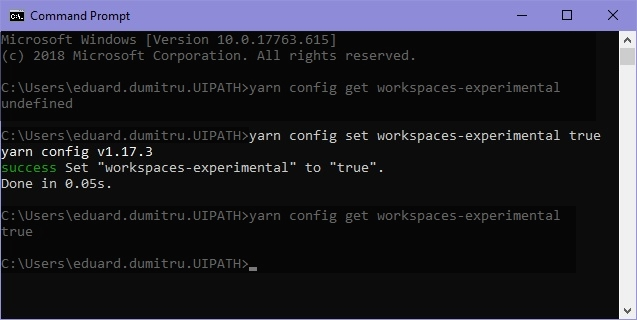
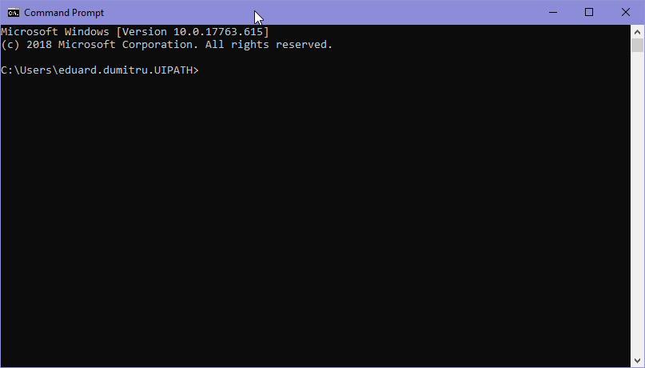
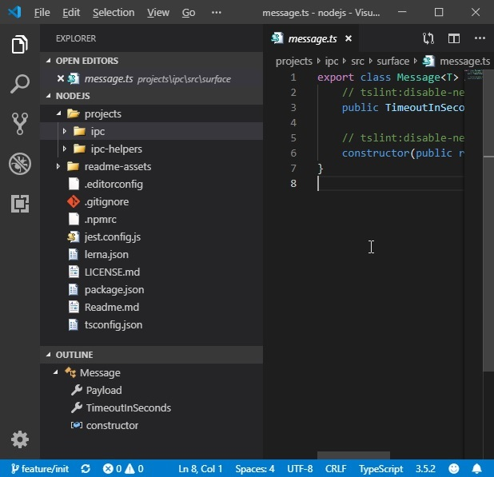
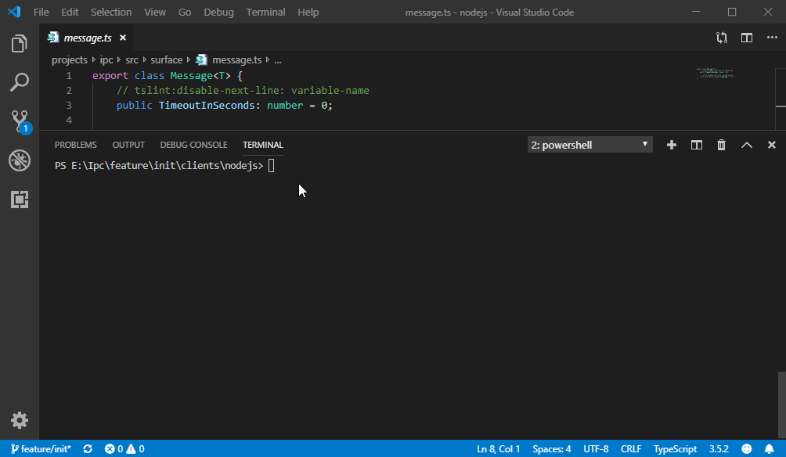
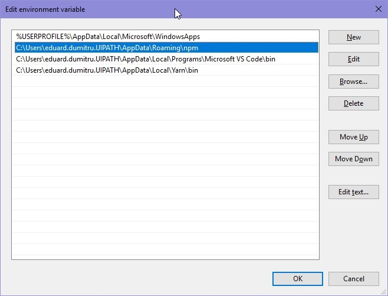

# UiPath IPC client for Nodejs - Contributors Guide

## Table of contents

1) [Audience](#audience)
2) [Preparing the workstation](#preparing-the-workstation)
3) [Preparing the workspace](#preparing-the-workspace)
4) [Publishing npm packages to a private feed (`Azure Devops` or `Github Package Registries`)](#publishing-npm-packages-to-a-private-feed-azure-devops-or-github-package-registries)
5) [Troubleshooting](#troubleshooting)

## Audience

This guide is intended for contributors of the `UiPath IPC client for Nodejs` library.

## Preparing the workstation:

1. Install [Nodejs 10.16.1 LTS](https://nodejs.org/dist/v10.16.1/node-v10.16.1-x64.msi)
2. Install [Visual Studio Code ^1.36.1](https://code.visualstudio.com/)
3. Install [Yarn ^1.17.3](https://yarnpkg.com/lang/en/docs/install/#windows-stable)
4. Enable [`Yarn Workspace`](https://yarnpkg.com/lang/en/docs/workspaces/) by running `yarn config set workspaces-experimental true`:

   

5. Install [Lerna 3.16.4](https://lerna.js.org/) by running `npm install --global lerna`:

   

6. Install the following `Visual Studio Code` extensions:

   - [Coverage Gutters](https://marketplace.visualstudio.com/items?itemName=ryanluker.vscode-coverage-gutters): Display test coverage generated by lcov or xml
   - [EditorConfig for VS Code](https://marketplace.visualstudio.com/items?itemName=EditorConfig.EditorConfig):    EditorConfig support for Visual Studio Code
   - [ESLint](https://marketplace.visualstudio.com/items?itemName=dbaeumer.vscode-eslint): Integrates ESLint JavaScript    into Visual Studio Code
   - [Jest](https://marketplace.visualstudio.com/items?itemName=Orta.vscode-jest): Jest support for Visual Studio Code
   - [npm](https://marketplace.visualstudio.com/items?itemName=eg2.vscode-npm-script): npm support for Visual Studio Code
   - [npm Intellisense](https://marketplace.visualstudio.com/items?itemName=christian-kohler.npm-intellisense): Visual    Studio Code extension for npm module autocompletion in import statements

## Preparing the workspace:

1. Clone the repo: `https://github.com/UiPath/Ipc.git`
2. Open `Visual Studio Code` and open the folder [`./clients/nodejs/`](./clients/nodejs/)

    

3. Open a terminal (`` Ctrl+Shift+` ``).
4. Run `yarn install` which will restore dependencies at workspace root level (much like `nuget restore`).
5. Run `lerna run build` which will build both workspace projects (`"ipc"` and `"ipc-helpers"`).
6. Run `lerna bootstrap` which will restore dependencies at project level, create symlinks, prepublish and prepare the both projects (`"ipc"` and `"ipc-helpers"`).
7. Run `yarn run unit` which will discover all tests and run them:

    

## Publishing npm packages to a private feed (`Azure Devops` or `Github Package Registries`)

1. Make sure you've authorized the workstation (the current user) to with a correct `%HOMEPATH%\.npmrc` file.
2. Run `lerna publish --skip-git` which will:
    - help increment the patch number of the current version of both projects (`"ipc"` and `"ipc-helpers"`)
    - package them
    - publish them to the private feed
    - will **not** push to `git` and will **not** create a tag in `git`

## Troubleshooting

1. If you receive an error stating that either `yarn`, `lerna` or `npm` commands could not be found, make sure that the following paths are present in the current users's `%PATH%` environment variable:

    - `%USERPROFILE%\AppData\Roaming\npm`
    - `%USERPROFILE%\AppData\Local\Yarn\bin`

    
