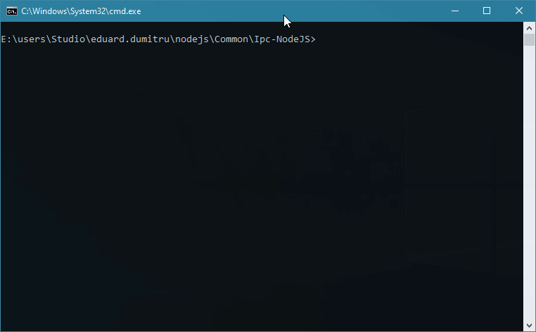
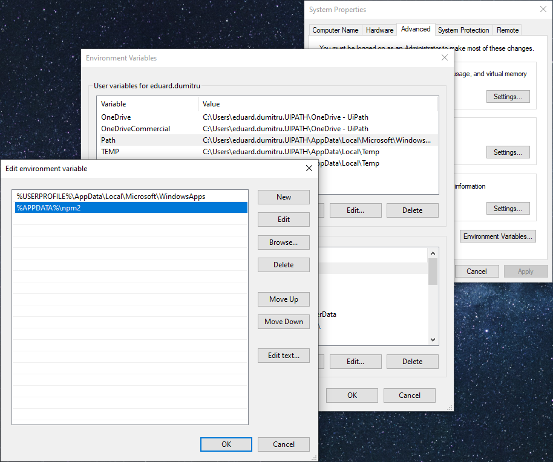

# UiPath Ipc Framework for Node.js

## Prerequisites

### Make sure you have installed the following tools (using their graphical installers):

- [Visual Studio Code: ^v1.36.1)](https://code.visualstudio.com/)
- [Node.js: ^v10.16.0 LTS](https://nodejs.org/en/)
- [Yarn: ^v1.17.3](https://yarnpkg.com/lang/en/docs/install/#windows-stable)

### From a terminal in the workspace's root (where `dir` would list the current `Readme.md` file):

- Enable ["Yarn Workspaces"](https://yarnpkg.com/lang/en/docs/workspaces/):
`yarn config set workspaces-experimental true`

- Install [Lerna ^v3.16.4](https://lerna.js.org/):

`npm install --global lerna`

### Recommended Visual Studio Code extensions:

- [Coverage Gutters](https://marketplace.visualstudio.com/items?itemName=ryanluker.vscode-coverage-gutters): Display test coverage generated by lcov or xml
- [EditorConfig for VS Code](https://marketplace.visualstudio.com/items?itemName=EditorConfig.EditorConfig): EditorConfig support for Visual Studio Code
- [ESLint](https://marketplace.visualstudio.com/items?itemName=dbaeumer.vscode-eslint): Integrates ESLint JavaScript into Visual Studio Code
- [Jest](https://marketplace.visualstudio.com/items?itemName=Orta.vscode-jest): Jest support for Visual Studio Code
- [npm](https://marketplace.visualstudio.com/items?itemName=eg2.vscode-npm-script): npm support for Visual Studio Code
- [npm Intellisense](https://marketplace.visualstudio.com/items?itemName=christian-kohler.npm-intellisense): Visual Studio Code extension for npm module autocompletion in import statements

### Troubleshooting

- If your terminal can't find `lerna` and you receive `"lerna : The term 'lerna' is not recognized as the name of a cmdlet function, script file, or operable program. Check the spelling of the name, or if a path was included, verify that the path is correct and try again."` make sure that the `lerna` was installed in `%APPDATA%\npm` and that `%APPDATA%\npm` is in the current user's `PATH`:

