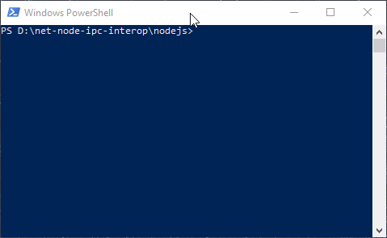
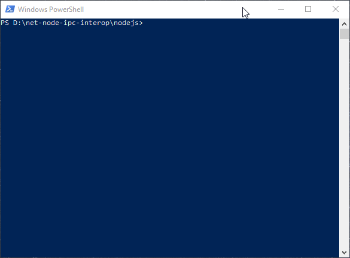

# UiPath.Ipc for Nodejs sample app walkthrough

## Introduction

We'll create a .NET server and a Nodejs client which communicate via UiPath.Ipc.
The server exposes a simple service endpoint which computes the product of two floating point numbers.

## Workstation setup

You'll need:
| Prerequisite | Installation                                                  | My version        | Notes |
| -------------|-------------------------------------------------------------- | ----------------- | ------------------------------------------ |
| `Nodejs`     | Get the **LTS** [here](https://nodejs.org/en/)                | 10.16.1           | Run `node -v` to see what you have. Update with the setup kit. |
| `npm`        | (bundled with `Nodejs`)                                       | 6.9.0             | Run `npm -v` to see what you have. Update with `npm install -g npm@latest` or by updating `Nodejs` itself.  |
| `Yarn`       | Get the **Stable** release [`here`](https://yarnpkg.com/en/)  | 1.17.3            | Run `yarn -v` to see what you have. Update with the setup kit. |
| `Typescript` | Run `npm install -g typescript` | 3.5.3  | Run `tsc -v` to see what you have. Update with `npm install -g typescript`. |

## Workspace setup

#### Step 1 - Prepare the workspace root

Create the following directory structure:

``` powershell
PS D:\> md net-node-ipc-interop
PS D:\> md net-node-ipc-interop\dotnet
PS D:\> md net-node-ipc-interop\nodejs
PS D:\> md net-node-ipc-interop\nodejs\src
```

> **Notes:**
> - For brevity, I'm using `D:\` as the path in which `net-node-ipc-interop` resides.
> - From now we'll call this path `%WSPACE%` (in other words `D:\net-node-ipc-interop` will be called `%WSPACE%\net-node-ipc-interop`)

#### Step 2 - Initialize _package.json_

Cd into `%WSPACE%\net-node-ipc-interop\nodejs` and create a `package.json` file by using `yarn init` and:
> - Name the package `math-client`
> - Set the `entry point` to `dist/index.js`.
    That's where our artifacts will live.
> - Set the `private` to `true`. This will instruct `npm` to never publish this package to a feed.



This will create `%WSPACE%\net-node-ipc-interop\nodejs\package.json` with the following contents:

``` json
{
  "name": "math-client",
  "version": "1.0.0",
  "main": "dist/index.js",
  "license": "MIT",
  "private": true
}
```

Open `package.json` and add the following fields to the `JSON` root:

``` json
{
  ...

  "scripts": {
    "build": "tsc",
    "start": "node ./dist/program.js"
  },
  "devDependencies": {
    "@types/node": "^9.4.6",
    "typescript": "^3.5.3"
  }

  ...
}
```

> **Note:**
> Basically we're telling the build environment 3 things:
> - We want to use the `TypeScript` compiler to build our package
> - And when running the application, we want to use `Nodejs` to execute a compiler-generated `JavaScript` file, `"program.js"`, located in the `"dist"` 
folder
> - And while restoring dependencies, we'll need `yarn` to fetch:
>     - the `TypeScript` definitions for `Nodejs` (which will not be needed at runtime but will be needed in the build step)
>     - and the `TypeScript` compiler itself (even though we already have it installed globally - see [Workstation Setup](#workstation-setup))

#### Step 3 - Add the runtime dependencies

Our app will reference the `UiPath Ipc for Nodejs` library.
The `npm` package which contains the library is called `@uipath/ipc` and depends on a secondary package called `@uipath/ipc-helpers`.

The library contained in the secondary package is mostly comprised of but not restricted to foundation classes concerned with asynchronous programming, idiomatic to `.NET`:
- `CancellationToken`
- `CancellationTokenSource`
- `PromiseCompletionSource<T>` (`Promise<T>` already lives in `ECMAScript`)

`UiPath Ipc for Nodejs` emulates the workflow of authoring contract interfaces established by its `UiPath Ipc` .NET counterpart, to the greatest extent allowed by `ECMAScript`. In that sense, the way to cancel in-flight remote calls is to trigger a `CancellationToken`.

Even though `npm` (and by extension `yarn`) dependencies are installed transitively, only top-level dependencies are exposed during build. Therefore, we need the `@uipath/ipc-helpers` package as a top-level dependency in order to use `CancellationToken` class when authoring our contract.

The dependency graph will include the following packages:

``` typescript
[math-client]
   ├───[@uipath/ipc]
   │      ├───[@uipath/ipc-helpers]
   │      │      │ ....
   │      │ ....
   └───[@uipath/ipc-helpers]
          │ ....
```

Add the following `JSON` field to _package.json_'s root:

``` json
{
    ...

    "dependencies": {
      "@uipath/ipc": "file:E:/Ipc/feature/init/clients/nodejs/projects/ipc/dist",
      "@uipath/ipc-helpers": "file:E:/Ipc/feature/init/clients/nodejs/projects/ipc-helpers/dist"
    },

    ...
}
```

> **Notes**:
> - For brevity I used the _local file system_ for referencing dependencies. When doing this you need to target the dependency's artifacts' directory (in the case of `@uipath/ipc` and `@uipath/ipc-helpers` that directory is called `"dist"`).
> - Normally you would simply state the dependency's package name and the artifacts would be fetched from a feed (npmjs.org or a private one).

#### Step 4 - Create the _tsconfig.json_ file

While still in `%WSPACE%\net-node-ipc-interop\nodejs`, run `tsc --init`. This will create `%WSPACE%\net-node-ipc-interop\nodejs\tsconfig.json`.

> **Note:** Running `tsc --init` is only useful for easily discovering all available options.

Open `tsconfig.json` and completely replace its contents with:

``` json
{
    "compilerOptions": {
        "target": "es5",
        "module": "commonjs",
        "declaration": true,
        "outDir": "./dist",
        "strict": true,
        "downlevelIteration": true,
        "stripInternal": true,
        "lib": [ "es2015" ],
        "skipLibCheck": true,
        "skipDefaultLibCheck": true
    },
    "include": [ "src/**/*" ],
    "exclude": [ "node_modules" ]
}
```

> **Note:** `UiPath Ipc for Nodejs` only supports dependent apps which target `ECMAScript 5`, at least for now

#### Step 5 - Restore dependencies

While still in `%WSPACE%\net-node-ipc-interop\nodejs`, run `yarn install`:



This will create a directory sub-tree in `%WSPACE%\net-node-ipc-interop\nodejs\node_modules\**` and the  `%WSPACE%\net-node-ipc-interop\nodejs\node_modules\yarn.lock` file.

Your workspace's directory structure should now be:
``` cmd
%WSPACE%
  ├───[dotnet]
  └───[nodejs]
         ├───[node_modules]
         │     ├───[.bin]
         │     ├───[@babel]
         │     ├───....
         │     ...
         ├───[src]
         ├───package.json
         ├───tsconfig.json
         └───yarn.lock
```

## Coding

#### Step 1 - IDE

- Open Visual Studio Code
- Within Visual Studio Code, open the `%WSPACE%\nodejs` folder
- Within the `%WSPACE%\nodejs\src` folder create the following empty files:
  - `contract.ts`
  - `math-callback.ts`
  - `program.ts`


#### Step 2 - The contract

In `%WSPACE%\nodejs\src\contract.ts` do these imports:

``` typescript
import { Message } from '@uipath/ipc';
import { CancellationToken } from '@uipath/ipc-helpers';
```

and add the following types:

``` typescript

/* @internal */
export class IMathService {
    MultiplyAsync(x: number, y: Message<number>, cancellationToken: CancellationToken): Promise<number> { throw null; }
}

/* @internal */
export interface IMathCallback {
    AddAsync(x: number, y: number): Promise<number>;
}

```

> **Note**: `IService` is a class while `ICallback` is an interface.

#### Step 3 - The callback implementation

In `%WSPACE%\nodejs\src\math-callback.ts` do these imports:

``` typescript
import { PromiseHelper } from '@uipath/ipc-helpers';
import { IMathCallback } from './contract';
```

and add the following class:

``` typescript

/* @internal */
export class MathCallback implements IMathCallback {

    public AddAsync(x: number, y: number): Promise<number> {
        const result = x + y;
        console.debug(`Callback.AddAsync(${x}, ${y}) => ${result}`);      
        return PromiseHelper.fromResult(result);
    }

}

```

#### Step 4 - The `Program` structure

In `%WSPACE%\nodejs\src\program.ts` do these imports:

``` typescript
import { NamedPipeClientBuilder, INamedPipeClient, Message } from '@uipath/ipc';
import { IMathService } from './contract';
import { MathCallback } from './math-callback';

class Program {

    public static async main(): Promise<void> {

        // ....

    }

}

Program.main().then(
    () => { console.debug(`Program terminated successfully.`) },
    error => { console.error(`Program crashed with error:\r\n${error}`) });
```

#### Step 5 - The actual logic

We will need to call the `createWithCallbackAsync` static method declared by `NamedPipeClientBuilder`, 

> **Note**: The method's signature is:
>
> ``` typescript
> static createWithCallbacksAsync<TService, TCallback>(
>     pipeName: string,
>     servicePrototype: TService,
>     callbackService: TCallback
> ): Promise<INamedPipeClient<TService>>;
> ```

inside `main`:

``` typescript
...

public static async main(): Promise<void> {

    const mathClient = await NamedPipeClientBuilder.createWithCallbacksAsync('math-pipe', new IMathService(), new MathCallback());

}

...
```

When the `Promise<INamedPipeClient<IMathClient>>` resolves, we're already connected to the server named pipe, behind the scenes.
We will need to dispose properly of the resulting client object, but for brevity we'll leave that for the end.

You can access the generated proxy via the `proxy` readonly instance field. The field's type will be `IService` in our case.
Calling the server is as easy as:

``` typescript
...
const result = await client.proxy.MultiplyAsync(14, new Message<number>(15), CancellationToken.default);
...
```

Your code should be:

``` typescript
import { NamedPipeClientBuilder, INamedPipeClient, Message } from '@uipath/ipc';
import { IMathService, IMathCallback } from './contract';
import { MathCallback } from './math-callback';
import { CancellationToken } from '@uipath/ipc-helpers';

class Program {

    public static async main(): Promise<void> {
        const client = await NamedPipeClientBuilder.createWithCallbacksAsync('math-pipe', new IMathService(), new MathCallback());
        
        const result = await client.proxy.MultiplyAsync(14, new Message<number>(15), CancellationToken.default);
        console.log(`MultiplyAsync(15, new Message<number>(15)) => ${result}`);
    }

}

Program.main().then(
    () => { console.debug(`Program terminated successfully.`) },
    error => { console.error(`Program crashed with error:\r\n${error}`) });
```

#### Step 6 - Disposing of the client

Make these modifications:

``` typescript
    public static async main(): Promise<void> {
        let client: INamedPipeClient<IMathService> | null = null;

        try{

            client = await NamedPipeClientBuilder.createWithCallbacksAsync('math-pipe', new IMathService(), new MathCallback());

            const result = await client.proxy.MultiplyAsync(14, new Message<number>(15), CancellationToken.default);
            console.log(`MultiplyAsync(15, new Message<number>(15)) => ${result}`);
            
        } finally {

            if (client) {
                await client.disposeAsync();
            }

        }
    }
```

#### Step 7 - Building and running the app

Cd into `%WSPACE%\nodejs\` and run:

``` cmd
yarn run build
yarn run start
```


