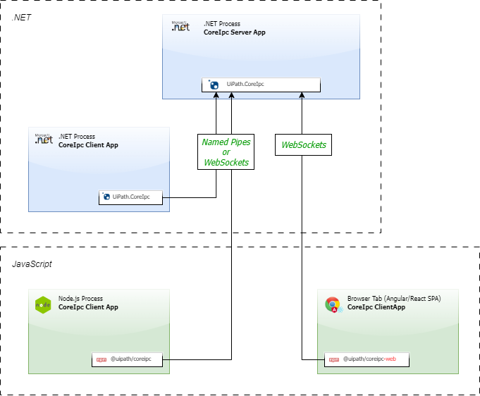

[](https://uipath.visualstudio.com/CoreIpc/_build/latest?definitionId=637&branchName=master)
[](https://github.com/UiPath/coreipc/packages/71523)

# CoreIpc client for Node.js
---

## Introduction

The [ `@uipath/coreipc`](https://github.com/UiPath/coreipc/packages/71523) **NPM package** is used to connect Node.js clients to .NET servers via CoreIpc and named pipes (unix sockets).



Similarly, the [ `@uipath/coreipc-web`](https://uipath.visualstudio.com/CoreIpc/_artifacts/feed/EddiesExperimentalFeed/Npm/@uipath%2Fcoreipc-web/overview/2.5.1-20230313-05) **NPM package** is used to connect JavaScript clients to .NET servers, but the clients are Web browsers and the connection is done via WebSockets.


---
## Installing the packages

1. Configure your `.npmrc` according to  [GitHub's documentation](https://docs.github.com/en/free-pro-team@latest/packages/using-github-packages-with-your-projects-ecosystem/configuring-npm-for-use-with-github-packages).

> Your `.npmrc` should be similar to:
>
> ```elixir
> //npm.pkg.github.com/:_authToken=<ANY VALID AUTH TOKEN>
> @uipath:registry=https://npm.pkg.github.com/
>
> ```

> **NOTE**: ❗️Before merging the the [Feat/js multitargeting](https://github.com/UiPath/coreipc/pull/87) PR, the **@uipath/coreipc-web** is not yet available on the GitHub Packages feed. Until that time, please check the Azure Artifacts specific configuration.

2. Install the [ `@uipath/coreipc`](https://github.com/UiPath/coreipc/packages/71523) and/or [ `@uipath/coreipc-web`](https://uipath.visualstudio.com/CoreIpc/_artifacts/feed/EddiesExperimentalFeed/Npm/@uipath%2Fcoreipc-web/overview/2.5.1-20230313-05) the  **NPM package** as a runtime dependency.

```elixir
npm install @uipath/coreipc@<SPECIFIC VERSION>
npm install @uipath/coreipc-web@<SPECIFIC VERSION>
```

3. Import the module and start using it:

```typescript
import { ipc } from '@uipath/coreipc';

async function main(): Promise<void> {
    ipc... // <--- use it wisely
}

const _ = main();
```

---

## Basic usage

This NPM package can be used to connect a Node.js client to a .NET server. The .NET server would host a service over named pipes (unix sockets) via the [`UiPath.CoreIpc` Nuget package](https://www.myget.org/feed/uipath-dev/package/nuget/UiPath.CoreIpc) and the Node.js client would connect to it and call its methods remotely.

## Translating a simple contract to TypeScript

Consider the following C# contract:

```csharp
using System.Threading.Tasks;

public interface IComputingService
{
    Task<double> Sum(double x, double y);
}
```

Its Typescript translation would be a class:

```typescript
import { ipc } from '@uipath/coreipc';

@ipc.$service
export class IComputingService {

    @ipc.$operation
    public Sum(x: number, y: number): Promise<number> { throw void 0; /* making the compiler happy 😁 */ }

}
```

> **NOTES**:
>
> - Contracts may only contain `Task`-returning methods.
>
> - `Task`(non generic)-returning methods (and their Node.js `Promise<void>`-returning counterparts) are fire & forget methods.
>
> - TypeScript contract methods' actual implementations do not matter. These methods are never called, only reflected upon. The reason these contracts aren't interfaces is because their metadata is needed at runtime and interfaces evaporate well before that.

## Connecting via named pipes to exposed services and calling their methods

```typescript
import { ipc } from '@uipath/coreipc';

// define your contract (see above)
import { IComputingService } from './contract';

async function main(): Promise<void> {
    // decide on a pipe name
    const pipeName = 'In-The-Pipe-5by5';

    // synchronously obtain a liteweight proxy around the pipe name the service contract
    const proxy = ipc.proxy
        .withAddress(options => options.isPipe(pipeName))
        .withService(IComputingService);

    // use the proxy
    await use(proxy);
}

async function use(computingService: IComputingService): Promise<void> {
    const expecting3 = await computingService.Sum(1, 2);

    console.log(`expecting3 === ${expecting3}`)
}

const _ = main();

```

## Canceling a call

When a contract method accepts a `CancellationToken` as its last parameter it might be the case that the operation triggered by calling the method can be canceled by means of a `CancellationTokenSource`.

Given the C# contract:

```csharp
// SampleContract.cs
public interface ISample
{
    Task<bool> WaitForever(CancellationToken ct);
}
```

One can translate it to TypeScript like so:

```typescript
// SampleContract.ts
import { ipc, CancellationToken } from '@uipath/coreipc';

export class ISample {
    public WaitForever(ct: CancellationToken): Promise<boolean> { throw void 0; }
}
```

And call it like:

```typescript
// index.ts
import { ipc, CancellationToken, CancellationTokenSource, OperationCanceledError } from '@uipath/coreipc';
import { ISample } from './SampleContract';

async function main(): Promise<void> {
    const sample = ipc.proxy.get('some-pipe', ISample);

    const cts = new CancellationTokenSource();

    setTimeout(() => {
        // this will run after 1 second
        cts.cancel(); // calling this will notify the .NET server
    }, 1000);

    const ct = cts.token;

    try {
        await sample.WaitForever(ct);
    } catch (err) {
        const willBeTrue = err instanceof OperationCanceledError;
        console.log(`willBeTrue === ${willBeTrue}`);
    }

    console.log('done');
}

const _ = main();
```

## Configuring the CoreIpc default request timeout

For any request:

```typescript
import { ipc, TimeSpan } from '@uipath/coreipc';

const _3seconds = TimeSpan.fromSeconds(3);

ipc.config
    .forAnyAddress()
    .forAnyService()
    .setRequestTimeout(_3seconds);
```

For a particular pipe name or Web socket URL:

```typescript
import { ipc, TimeSpan } from '@uipath/coreipc';

const _3seconds = TimeSpan.fromSeconds(3);
const whichPipe = 'this one';

ipc.config
    .forAddress(options => options.isPipe(whichPipe))
    .forAnyService()
    .setRequestTimeout(_3seconds);

// alternatively, for Web sockets:

ipc.config
    .forAddress(options => options.isWebSocket("...URL..."))
    .forAnyService()
    .setRequestTimeout(_3seconds);

```

For a particular contract:

```typescript
import { ipc, TimeSpan } from '@uipath/coreipc';
import { ISample } from './SampleContract';

const _3seconds = TimeSpan.fromSeconds(3);

ipc.config
    .forAnyAddress()
    .forService(ISample)
    .setRequestTimeout(_3seconds);
```

For a particular contract and pipe name/Web socket URL:

```typescript
import { ipc, TimeSpan } from '@uipath/coreipc';
import { ISample } from './SampleContract';

const whichPipe = 'this one';
const _3seconds = TimeSpan.fromSeconds(3);

ipc.config
    .forAddress(options => options.isPipe(whichPipe))
    .forService(ISample)
    .setRequestTimeout(_3seconds);

// alternatively, for Web Sockets:

ipc.config
    .forAddress(options => options.isWebSocket("...URL..."))
    .forService(ISample)
    .setRequestTimeout(_3seconds);
```

> **NOTES:**
> - All configurations are stored but choosing the same pipe name / contract in a 2nd configuration call will overwrite the previous configuration.
>
> - Specific configurations outweigh generic ones, i.e, given the following configurations:
>   ```
>   - set the request timeout in general to 1 second
>   - set the request timeout for pipe name "foo" to 2 seconds
>   - set the request timeout for pipe name "foo" and contract ISample to 3 seconds
>   ```
>   the following facts are correct:
>   ```
>   - the request timeout for pipe name "bar" and contract IAlgebra is 1 second
>   - the request timeout for pipe name "foo" and contract IAlgebra is 2 seconds
>   - the request timeout for pipe name "foo" and contract ISample is 3 seconds
>   ```

---
## Notes for Contributors

### Regarding the Codebase anatomy

The `src/node` and `src/std` directories together produce the Node.js NPM package, while the `src/web` and `src/std` directories together produce the Web package.

```
📂 src
  📂 node ─┐
    📂 ..  ├───────────┐
  📂 std ──┼───────────┼───────┐
    📂 .. ─┘           │       ├─────────┐
  📂 web               │       │         │
    📂 .. ─────────────┼───────┘         │
📂 test                │             produces
  📂 ..            produces              │
📂 dist                │                 │
  📂 ..                │                 │
📂 dist-packages       ↓                 │
  💻 uipath-coreipc-{Version}.tgz        │
  🕸️ uipath-coreipc-web-{Version}.tgz ←──┘
```
